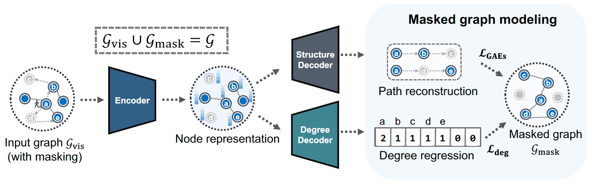

# MaskGAE
PyTorch implementation of the paper [MaskGAE: Masked Graph Modeling Meets Graph Autoencoders](https://arxiv.org/abs/2205.10053).

<p align="center">  <p align="center"><em>Fig. 1. Masked Graph Autoencoders.</em></p>

# Requirements
Higher versions should be also available.

+ numpy==1.18.1
+ torch==1.12.1+cu102
+ torch-cluster==1.6.0
+ torch_geometric>=2.1.0
+ torch-scatter==2.0.9
+ torch-sparse==0.6.14
+ CUDA 10.2
+ CUDNN 7.6.0

# Installation

```bash
pip install -r requirements.txt
```

# Reproduction

## Link prediction
+ Cora
```bash
# 96.40 ± 0.25
# 95.94 ± 0.28
python train_linkpred.py --dataset Cora --bn --decoder_dropout 0.1 --p 0.3

# 96.39 ± 0.14
# 95.93 ± 0.18
python train_linkpred.py --dataset Cora --bn --decoder_dropout 0.1 --mask Edge --p 0.7
```

+ Citeseer
```bash
# 97.78 ± 0.15
# 98.01 ± 0.13
python train_linkpred.py --dataset Citeseer --bn --p 0.3

# 97.73 ± 0.24
# 97.98 ± 0.20
python train_linkpred.py --dataset Citeseer --bn --mask Edge --p 0.7
```

+ Pubmed
```bash
# 98.80 ± 0.04
# 98.71 ± 0.04
python train_linkpred.py --dataset Pubmed --bn --encoder_dropout 0.2 --p 0.3

# 98.83 ± 0.04
# 98.72 ± 0.06
python train_linkpred.py --dataset Pubmed --bn --encoder_dropout 0.2 --mask Edge --p 0.7
```

## Node classification

+ Cora
```bash
# 84.30 ± 0.39
python train_nodeclas.py --dataset Cora --bn --l2_normalize --nodeclas_weight_decay 1e-4 --alpha 0.002 --p 0.3

# 84.22 ± 0.22
python train_nodeclas.py --dataset Cora --bn --l2_normalize --nodeclas_weight_decay 1e-4 --alpha 0.002 --mask Edge --p 0.7
```

+ Citeseer
```bash
# 73.55 ± 0.53
python train_nodeclas.py --dataset Citeseer --bn --l2_normalize --nodeclas_weight_decay 0.1 --alpha 0.001 --decoder_dropout 0. --lr 0.02 --p 0.3 --walk_length 4

# 72.72 ± 0.92
python train_nodeclas.py --dataset Citeseer --bn --l2_normalize --nodeclas_weight_decay 0.1 --alpha 0.001 --decoder_dropout 0. --lr 0.02 --mask Edge --p 0.7
```

+ Pubmed
```bash
# 83.13 ± 0.47
python train_nodeclas.py --dataset Pubmed --bn --l2_normalize --nodeclas_weight_decay 1e-4 --alpha 0.001 --decoder_dropout 0.5 --p 0.3

# 82.36 ± 0.47
python train_nodeclas.py --dataset Pubmed --bn --l2_normalize --nodeclas_weight_decay 1e-4 --alpha 0.001 --decoder_dropout 0.5 --mask Edge --p 0.5
```

+ Photo
```bash
# 93.33 ± 0.12
python train_nodeclas.py --dataset Photo --bn --nodeclas_weight_decay 5e-3 --alpha 0.0 --decoder_channels 64 --p 0.3

# 93.24 ± 0.07
python train_nodeclas.py --dataset Photo --bn --nodeclas_weight_decay 5e-3 --alpha 0.0 --decoder_channels 64 --mask Edge --p 0.7

```

+ Computers
```bash
# 89.79 ± 0.07
python train_nodeclas.py --dataset Computers --alpha 0. --bn --encoder_activation relu --encoder_dropout 0.5 --encoder_channels 128 --hidden_channels 256 \
                          --nodeclas_weight_decay 5e-4 --p 0.6
# 89.78 ± 0.14
python train_nodeclas.py --dataset Computers --alpha 0. --bn --encoder_dropout 0.5 --encoder_channels 128 --hidden_channels 256 \
                          --nodeclas_weight_decay 5e-4 --mask Edge --p 0.7
```

+ arxiv
```bash
# 70.58 ± 0.23
python train_nodeclas.py --dataset arxiv --alpha 0.001 --bn --decoder_channels 128 --decoder_dropout 0.1 --decoder_layers 4 \
                          --encoder_channels 512 --encoder_dropout 0.6 --encoder_layers 4 \
                          --hidden_channels 256 --lr 0.001 --nodeclas_weight_decay 5e-6 --weight_decay 0.0001 --p 0.3 --debug                          
                 
# 70.28 ± 0.26
python train_nodeclas.py --dataset arxiv --alpha 0.001 --bn --decoder_channels 128 --decoder_dropout 0.1 --decoder_layers 4 \
                          --encoder_channels 512 --encoder_dropout 0.6 --encoder_layers 4 \
                          --hidden_channels 256 --lr 0.001 --nodeclas_weight_decay 5e-6 --weight_decay 0.0001 --mask Edge --p 0.7 --debug

```

# Graph Classification

+ MUTAG
```bash
# 89.47 ± 0.11
python train_graphclas.py --dataset MUTAG --alpha 0.001 --bn --pooling sum --hidden_channels 128 --p 0.3

# 89.45 ± 0.08
python train_graphclas.py --dataset MUTAG --alpha 0.001 --bn --pooling sum --hidden_channels 128 --mask Edge --p 0.7
```

+ MUTAG
```bash
# 74.63 ± 0.05
python train_graphclas.py --dataset IMDB-BINARY --alpha 0.001 --bn --pooling mean --hidden_channels 512 --decoder_layers 2 --p 0.5

# 75.23 ± 0.04
python train_graphclas.py --dataset IMDB-BINARY --alpha 0.001 --bn --pooling mean --encoder_activation relu --hidden_channels 256 --decoder_layers 4 --mask Edge --p 0.7

```

# Cite

```bibtex
@article{li_maskgae,
  author    = {Jintang Li and
               Ruofan Wu and
               Wangbin Sun and
               Liang Chen and
               Sheng Tian and
               Liang Zhu and
               Changhua Meng and
               Zibin Zheng and
               Weiqiang Wang},
  title     = {MaskGAE: Masked Graph Modeling Meets Graph Autoencoders},
  journal   = {CoRR},
  volume    = {abs/2205.10053},
  year      = {2022}
}
```