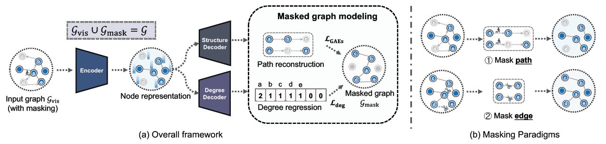
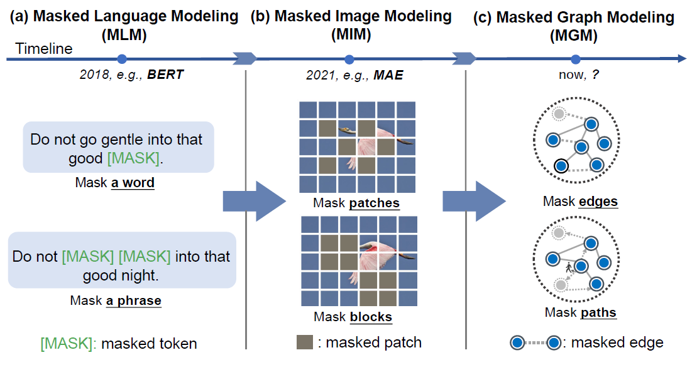

# MaskGAE


> [**What’s Behind the Mask: Understanding Masked Graph Modeling for Graph Autoencoders**](https://arxiv.org/abs/2205.10053) (KDD 2023)\
> [**MaskGAE: Masked Graph Modeling Meets Graph Autoencoders**](https://arxiv.org/abs/2205.10053v1) (arXiv 2022)
>
> Jintang Li, Ruofan Wu, Wangbin Sun, Liang Chen, Sheng Tian, Liang Zhu, Changhua Meng, Zibin Zheng, Weiqiang Wang    

**This repository is an official PyTorch implementation of MaskGAE.**
<p align="center">
  
<p align="center"><em>Fig. 1. MaskGAE framework and masking strategies.</em>
</p>

# Abstract
The last years have witnessed the emergence of a promising self-supervised learning strategy, referred to as masked autoencoding. However, there is a lack of theoretical understanding of how masking matters on graph autoencoders (GAEs). In this work, we present masked graph autoencoder (MaskGAE), a self-supervised learning framework for graph-structured data. Different from standard GAEs, MaskGAE adopts masked graph modeling (MGM) as a principled pretext task - masking a portion of edges and attempting to reconstruct the missing part with partially visible, unmasked graph structure. To understand whether MGM can help GAEs learn better representations, we provide both theoretical and empirical evidence to comprehensively justify the benefits of this pretext task. Theoretically, we establish close connections between GAEs and contrastive learning, showing that MGM significantly improves the self-supervised learning scheme of GAEs. Empirically, we conduct extensive experiments on a variety of graph benchmarks, demonstrating the superiority of MaskGAE over several state-of-the-arts on both link prediction and node classification tasks.

<p align="center">
  
<p align="center"><em>Fig. 2. Comparison of masked language modeling (MLM), masked image modeling (MIM) and masked graph modeling (MGM).</em>
</p>


# News

+ Nov 30, 2023: 🔥🔥🔥 MaskGAE based solution has just won the 2nd place in [ICDM Cup 2023](https://tugraph.antgroup.com/blog?id=15): community detection based on graph pretrained models. Code is open-sourced [here](https://github.com/Echochef/ICDM), congrats!
+ Oct 27, 2023: 🔥🔥🔥 Check out our poster [here](./poster.pdf)!

# Requirements
Higher versions should be also available.

+ numpy==1.21.6
+ torch==1.12.1+cu102
+ torch-cluster==1.6.0
+ torch_geometric>=2.4.0
+ torch-scatter==2.0.9
+ torch-sparse==0.6.14
+ scipy==1.7.3
+ texttable==1.6.2
+ CUDA 10.2
+ CUDNN 7.6.0

# Installation

```bash
pip install -r requirements.txt
```

# Dataset
| Dataset      | #Nodes     | #Edges     | #Features | #Classes | Density   |
|--------------|------------|------------|-----------|----------|-----------|
| Cora         | 2,708      | 10,556     | 1,433     | 7        | 0.144%    |
| CiteSeer     | 3,327      | 9,104      | 3,703     | 6        | 0.082%    |
| Pubmed       | 19,717     | 88,648     | 500       | 3        | 0.023%    |
| Photo        | 7,650      | 238,162    | 745       | 8        | 0.407%    |
| Computer     | 13,752     | 491,722    | 767       | 10       | 0.260%    |
| arXiv        | 16,9343    | 2,315,598  | 128       | 40       | 0.008%    |
| MAG          | 736,389    | 10,792,672 | 128       | 349      | 0.002%    |
| Collab       | 235,868    | 1,285,465  | 128       | -        | 0.002%    |

All datasets used throughout experiments are publicly available in [PyTorch Geometric library](https://github.com/pyg-team/pytorch_geometric).

# Reproduction
## Clone this project
```bash
git clone https://github.com/EdisonLeeeee/MaskGAE.git
cd MaskGAE
```

## Link prediction experiments
+ Cora
```bash
python train_linkpred.py --dataset Cora --bn
python train_linkpred.py --dataset Cora --bn --mask Edge
```
+ Citeseer
```bash
python train_linkpred.py --dataset Citeseer --bn
python train_linkpred.py --dataset Citeseer --bn --mask Edge
```
+ Pubmed
```bash
python train_linkpred.py --dataset Pubmed --bn --encoder_dropout 0.2
python train_linkpred.py --dataset Pubmed --bn --encoder_dropout 0.2 --mask Edge
```
+ Collab
```bash
python train_linkpred_ogb.py
python train_linkpred_ogb.py --mask Edge
```

## Node classification experiments

+ Cora
```bash
python train_nodeclas.py --dataset Cora --bn --l2_normalize --alpha 0.004 --full_data
python train_nodeclas.py --dataset Cora --bn --l2_normalize --alpha 0.003 --mask Edge --eval_period 10
```
+ Citeseer
```bash
python train_nodeclas.py --dataset Citeseer --bn --l2_normalize --nodeclas_weight_decay 0.1 --alpha 0.001 --lr 0.02 --full_data
python train_nodeclas.py --dataset Citeseer --bn --l2_normalize --nodeclas_weight_decay 0.1 --alpha 0.001  --lr 0.02 --mask Edge
```
+ Pubmed
```bash
python train_nodeclas.py --dataset Pubmed --bn --l2_normalize --alpha 0.001  --encoder_dropout 0.5 --decoder_dropout 0.5 --full_data
python train_nodeclas.py --dataset Pubmed --bn --l2_normalize --alpha 0.001  --encoder_dropout 0.5 --mask Edge
```
+ Photo
```bash
python train_nodeclas.py --dataset Photo --bn --nodeclas_weight_decay 5e-3 --decoder_channels 128 --lr 0.005
python train_nodeclas.py --dataset Photo --bn --nodeclas_weight_decay 5e-3 --decoder_channels 64 --mask Edge
```
+ Computers
```bash
python train_nodeclas.py --dataset Computers --bn --encoder_dropout 0.5 --alpha 0.002 --encoder_channels 128 --hidden_channels 256 --eval_period 20
python train_nodeclas.py --dataset Computers --bn --encoder_dropout 0.5 --alpha 0.003 --encoder_channels 128 --hidden_channels 256 --eval_period 10 --mask Edge
```
+ arxiv
```bash
python train_nodeclas.py --dataset arxiv --bn --decoder_channels 128 --decoder_dropout 0. --decoder_layers 4 \
                          --encoder_channels 256 --encoder_dropout 0.2 --encoder_layers 4 \
                          --hidden_channels 512 --lr 0.0005 --nodeclas_weight_decay 0 --weight_decay 0.0001 --epochs 100  \
                          --eval_period 10
python train_nodeclas.py --dataset arxiv --bn --decoder_channels 128 --decoder_dropout 0. --decoder_layers 4 \
                          --encoder_channels 256 --encoder_dropout 0.2 --encoder_layers 4 \
                          --hidden_channels 512 --lr 0.0005 --nodeclas_weight_decay 0 --weight_decay 0.0001 --epochs 100  \
                          --eval_period 10 --mask Edge
```
+ MAG
```bash
python train_nodeclas.py --dataset mag --alpha 0.003 --bn --decoder_channels 128\
                         --encoder_channels 256 --encoder_dropout 0.7 --epochs 100 \
                         --hidden_channels 128 --nodeclas_weight_decay 1e-5 --weight_decay 5e-5 --eval_period 10                                       
python train_nodeclas.py --dataset mag --alpha 0.003 --bn --decoder_channels 128
                         --encoder_channels 256 --encoder_dropout 0.7 --epochs 100 \
                         --hidden_channels 128 --nodeclas_weight_decay 1e-5 --weight_decay 5e-5 --eval_period 10 --mask Edge   
```


# Citation

```bibtex
@inproceedings{maskgae,
  author       = {Jintang Li and
                  Ruofan Wu and
                  Wangbin Sun and
                  Liang Chen and
                  Sheng Tian and
                  Liang Zhu and
                  Changhua Meng and
                  Zibin Zheng and
                  Weiqiang Wang},
  title        = {What's Behind the Mask: Understanding Masked Graph Modeling for Graph
                  Autoencoders},
  booktitle    = {{KDD}},
  pages        = {1268--1279},
  publisher    = {{ACM}},
  year         = {2023}
}
```
